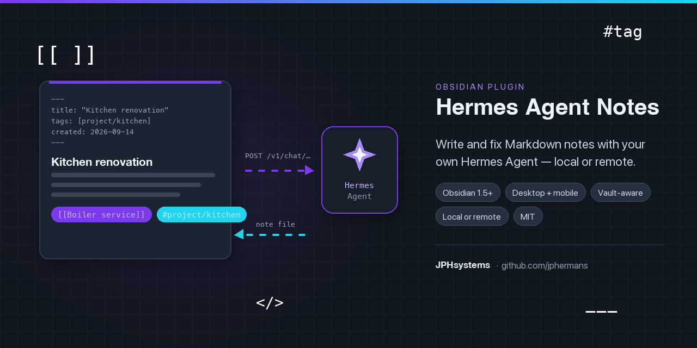

<p align="center">
  
</p>

# Hermes Agent Notes

**Write and repair Obsidian notes with your own [Hermes Agent](https://github.com/NousResearch/hermes-agent) instance — local or remote — following your vault's Obsidian conventions.**

[](https://github.com/jphermans/hermes-obsidian/releases)
[](LICENSE)

Hermes runs on your machine or on a server you own. The plugin talks to its OpenAI-compatible API server, sends your request together with a summary of how *your* vault writes Markdown, and writes the finished note into the vault itself — on desktop and on iOS/Android. No third-party service is involved beyond whatever your Hermes instance already uses.

---

## Contents

- [How it works](#how-it-works)
- [Requirements](#requirements)
- [Install with BRAT](#install-with-brat)
- [Setup](#setup)
- [Reachable from anywhere](#reachable-from-anywhere)
- [Commands](#commands)
- [Following Obsidian's rules](#following-obsidians-rules)
- [Mobile](#mobile)
- [Data, privacy and safety](#data-privacy-and-safety)
- [Settings file and backup](#settings-file-and-backup)
- [Troubleshooting](#troubleshooting)
- [Development](#development)
- [Releasing (BRAT)](#releasing-brat)
- [Author](#author)

---

## How it works

1. **You ask.** "Meeting notes for the kitchen renovation kickoff", "improve this note", "fix the Obsidian formatting".
2. **The plugin adds context.** A summary of your vault's own conventions (properties and their types, tag style, link style, headings, file names, callouts) plus the names of notes in the target folder, so links resolve to real notes. It also carries the full Obsidian Markdown syntax rules.
3. **You confirm.** Hermes returns the complete note file; you see a rendered preview, the raw Markdown you can edit, the file name, and Obsidian syntax checks. Nothing is written until you press the button.

Hermes never needs access to your vault — the plugin does all the file work.

## Requirements

* Obsidian **1.5.0** or newer (desktop, iOS or Android).
* A Hermes Agent install with its API server enabled (`API_SERVER_ENABLED=true`) and reachable from the device running Obsidian.
* The `API_SERVER_KEY` from that instance.

## Install with BRAT

1. Install **BRAT** (*Obsidian42 - BRAT*) from Community plugins.
2. Command palette → **BRAT: Add a beta plugin for testing**.
3. Enter `jphermans/hermes-obsidian` and confirm.
4. Enable **Hermes Agent Notes** in *Settings → Community plugins*.
5. Open *Settings → Hermes Agent Notes* and fill in your Hermes connection.

BRAT installs the newest GitHub release. To update later: **BRAT: Check for updates to all beta plugins**.

<details>
<summary>Manual install instead</summary>

Download `main.js`, `manifest.json` and `styles.css` from the [latest release](https://github.com/jphermans/hermes-obsidian/releases/latest) and place them in `<vault>/.obsidian/plugins/hermes-agent-notes/`, then enable the plugin.
</details>

## Setup

### 1. Enable the API server on the Hermes host

```bash
hermes config set API_SERVER_ENABLED true
hermes config set API_SERVER_KEY my-secret-key
hermes gateway stop && hermes gateway
```

The flag lands in `config.yaml`, the key in `~/.hermes/.env`. You should see:

```
[API Server] API server listening on http://127.0.0.1:8642
```

### 2. Check that it answers

```bash
curl -s http://127.0.0.1:8642/health
curl -s -H "Authorization: Bearer my-secret-key" http://127.0.0.1:8642/v1/models
```

The first returns `{"status": "ok"}`; the second lists the agent as a model. A `401` means the key does not match.

### 3. Fill in the plugin

*Settings → Hermes Agent Notes*:

| Field | Value |
| --- | --- |
| API server URL | `http://127.0.0.1:8642` (no `/v1` suffix; a port is optional) |
| API key | the same value as `API_SERVER_KEY` |
| Model | leave `hermes-agent` — Hermes normally uses its own configured default |
| Profile prefix | only when the gateway serves several profiles |

On a phone or tablet, `127.0.0.1` / `localhost` cannot be saved: that address points at the phone itself. Use the https:// address of your Tailscale, Cloudflare Tunnel or ngrok route (see below), or press *Save anyway* if Hermes really runs on that device.

Press **Test connection**. A green card with the advertised model name means you are connected.

Then type a prompt in **Ask Hermes** (just below the connection fields) and press *Send to Hermes*: the answer appears in place, with the model, the round-trip time and whether it streamed. That goes through the plugin's normal path — Obsidian rules, your vault conventions, session headers — so it proves the whole chain works, not just that the port is open. It writes nothing to the vault, and it is the quickest way to check a new route from a phone. Four sample prompts are one click away, including *Describe my vault's style*, which shows whether the vault scan reached Hermes.

### Remote instances

* Bind beyond loopback (`API_SERVER_HOST=0.0.0.0`) or publish it through a tunnel, then use that address in the plugin.
* **Prefer HTTPS.** iOS and Android are far stricter than desktop about plain-HTTP traffic, so a TLS reverse proxy (Caddy, Tailscale, Cloudflare Tunnel) is the reliable path on mobile.
* The key protects a full agent with terminal access. Treat it like an SSH password.
* **Several profiles:** give each its own port and key, or enable `gateway.multiplex_profiles` and set the profile prefix — `/p/<profile>` accepts only that profile's own key.

### Streaming (optional)

Live token output is a browser request, so the Hermes side needs an explicit origin allowlist:

```
API_SERVER_CORS_ORIGINS=app://obsidian.md,capacitor://localhost,http://localhost
```

Restart the gateway afterwards. Desktop presents `app://obsidian.md`, iOS `capacitor://localhost`, Android `http://localhost`. With **Stream answers** off (the default) the plugin uses Obsidian's native HTTP client and needs no CORS entry at all — and if a streaming request is refused, it falls back to that transport automatically.

## Reachable from anywhere

Phones and tablets refuse plain HTTP to another machine (iOS ATS, Android network security), so `http://192.168.x.x:8642` works on desktop but not on mobile. Expose the API server over HTTPS and the same URL works from every device, on any network.

The setup page asks **How do you reach Hermes?** — local, same-network, Tailscale, Cloudflare Tunnel, ngrok, or a custom HTTPS proxy — and then shows that route's commands, its URL shape, the headers it needs, whether phones can use it, and a **Test this route** button. Nothing is rewritten behind your back: press *Use …* to drop the URL template in, *Insert needed headers* to add what the route requires.

```bash
# Tailscale — HTTPS address for every device on your tailnet, nothing public
tailscale serve --bg 8642          # then use https://<machine>.<tailnet>.ts.net

# Cloudflare Tunnel — public HTTPS hostname without opening a port
cloudflared tunnel --url http://127.0.0.1:8642

# ngrok — quick public HTTPS URL for testing from a phone
ngrok http 8642
ngrok http --url=your-name.ngrok.app 8642      # reserved domain, stable URL
```

```caddyfile
# Caddy on the host: automatic HTTPS in front of the API server
hermes.example.com {
    reverse_proxy 127.0.0.1:8642
}
```

Keep the API server bound to `127.0.0.1` and let the tunnel or proxy be the only way in. The plugin treats an `https://…` URL exactly like a local one — same transport, same streaming behaviour, no extra configuration.

**The port is optional.** Omit it when the tunnel or proxy terminates HTTPS on 443: `https://hermes.example.com` is a valid API server URL and the plugin requests `https://hermes.example.com/v1/…`. A port is only needed when nothing sits on the default 80/443 — a direct API server (`:8642`) or a LAN address. You can also leave the scheme out: a public hostname is treated as `https`, a LAN or loopback address as `http`.

**Behind Cloudflare Access, an authenticating proxy or a gateway that wants its own headers**, add them in *Extra request headers* (one `Name: value` per line):

```
CF-Access-Client-Id: xxxx.access
CF-Access-Client-Secret: yyyy
```

A header named `Authorization` replaces the API key. The plugin warns you in-app when the configured URL is plain HTTP while you are on a mobile device, and it names HTTPS as the fix instead of failing silently.

**Two gotchas on these routes.** Cloudflare Tunnel quick tunnels get a new random URL on every restart — use a named tunnel for anything permanent, and put Cloudflare Access (service token) in front of it. ngrok's free tier shows an interstitial page to browsers, which the suggested `ngrok-skip-browser-warning: true` header skips; do **not** use `ngrok --basic-auth`, because its `Authorization` header would replace your Hermes API key.

**Security.** The key protects a full agent with terminal access on that machine. Prefer Tailscale or Cloudflare Access over a bare public port, and rotate `API_SERVER_KEY` if it ever leaks.

## Commands

| Command | What it does |
| --- | --- |
| **Open the chat panel** | Sidebar conversation with history, streaming and note actions. |
| **Create a note from a prompt** | Writes a complete new note — properties, headings, wikilinks, tags — for you to confirm. |
| **Improve the active note** | Rewrites the open note, keeping every existing property, link and fact. |
| **Rewrite the active note with an instruction** | "shorter", "add a decisions table", "split this into a project note". |
| **Fix the active note for Obsidian** | Repairs Obsidian syntax only — broken wikilinks, illegal characters, malformed frontmatter, heading jumps, curly quotes — without touching your prose. |
| **Ask Hermes about the active note** | Vault-aware answers with *Insert at cursor* / *Append* / *Save as note*. |
| **Turn the selection into a note** | Uses the selected text as source material. |
| **Insert a Hermes answer at the cursor** | Inline help without leaving the editor. |
| **Test the Hermes connection** | Health check plus model discovery, with a plain-language diagnosis. |
| **Show detected vault conventions** | See exactly what the plugin learned — and rescan it. |
| **Rescan vault conventions** | Force a fresh analysis. |

## Following Obsidian's rules

A model that knows Markdown still gets Obsidian wrong, so the plugin does two things.

**It carries the Obsidian format rules** — `---` YAML properties with no tabs and real date/boolean types, one H1 then H2/H3 without skipping levels, `[[Wikilinks]]` instead of `[path](note.md)`, `[[Note|alias]]`, `[[Note#Heading]]`, `[[Note#^block]]`, `![[embeds]]`, nested `#tag/child`, `> [!note]` callouts, two-space list nesting, `- [ ]` tasks, tables, fenced code with a language, straight quotes, and the file-name characters Obsidian refuses to store.

**It learns your vault first** — which properties you use and their types, whether values are quoted, tag style, wikilink versus Markdown links, whether notes open with an H1, your file-name style, the callouts you actually use, and the notes in the target folder so wikilinks point at real notes.

Every generated note is checked before it is written: property/word/link counts, balanced `[[ ]]`, `.md` links that should be wikilinks, heading level jumps, tabs in YAML, unparsed frontmatter, illegal file-name characters.

On a rewrite, existing frontmatter values are preserved and missing keys added — properties are never silently replaced.

## Mobile

Hermes Agent Notes is `isDesktopOnly: false` and was written for mobile from the start:

* Obsidian's native `requestUrl` for every normal call — no CORS, no browser cleartext-traffic restrictions, identical on iOS and Android.
* No Node.js imports anywhere (the usual reason plugins crash on mobile).
* No auto-focus on mobile, so the keyboard never covers a dialog; 16px inputs so iOS does not zoom the viewport; 44px touch targets; responsive layout; clipboard fallback for older WebViews.
* The chat panel is a normal sidebar view, so it works on phones and tablets.

The vault-convention scan reads from Obsidian's cache and takes ~20 ms on a 585-note vault.

## Data, privacy and safety

* Settings — including the API key and any extra headers — live in `<vault>/.obsidian/plugins/hermes-agent-notes/data.json`. Keep the vault private and prefer a key you can rotate.
* Only two things leave the vault: the conventions summary and the notes you explicitly send as context (trimmed to ~12 000 characters). The scan itself never leaves your machine.
* The plugin never touches a note you did not ask it to change, and every write goes through the preview.
* Requests go only to the Hermes URL you configure. Session reporting is opt-in and exists so long runs appear in Hermes session history.

## Settings file and backup

Settings normally live in `<vault>/.obsidian/plugins/hermes-agent-notes/data.json`. Two extra files keep them safe:

| File | Where | Purpose |
| --- | --- | --- |
| Automatic backup | `.obsidian/plugins/hermes-agent-notes/settings-backup.json` | Written (debounced, ~1.2 s) after every settings change when *Automatic backup file* is on — the default. Recovers your setup if the plugin folder is wiped by a reinstall or a sync conflict. |
| Exported settings | `<default folder>/Hermes Agent Notes settings.json` | Written only when you press **Export to the vault**. A visible file you can read, version or move between machines. |

**Restore** — either pick a JSON file from the vault (**Restore from a file…**) or read the automatic backup back (**Restore automatic backup**). Imports are validated: unknown keys and values of the wrong type are skipped and reported in the notice, so a stale or hand-edited file cannot half-break your setup. Caches (the vault analysis, the last connection state) are never exported or imported — they are rebuilt.

Both files contain your **API key and any extra headers** in plain text, because that is the point of a backup. Keep the vault (and anything synced from it) private, or export to a folder you control.

## Troubleshooting

| Symptom | Fix |
| --- | --- |
| **Connection failed — could not reach Hermes** | Is `hermes gateway` running with `API_SERVER_ENABLED=true`? Is the host/port right, and reachable from this device? |
| **HTTP 401 / rejected the request** | The API key does not match `API_SERVER_KEY` on the host. |
| **HTTP 404** | Wrong base URL, or a profile prefix set while the gateway is not running in multi-profile mode. Remove any `/v1` suffix from the URL. |
| **HTTP 429** | Too many concurrent runs on the Hermes side — retry, or raise `gateway.api_server.max_concurrent_runs`. |
| **No model in the dropdown** | Harmless: `/v1/models` advertises one agent name. Press *Test connection* and use that name. |
| **Streaming was refused** | Add the `API_SERVER_CORS_ORIGINS` line above and restart the gateway, or turn streaming off. |
| **Phone cannot reach the instance at all** | Plain HTTP to another machine is blocked on mobile. Use HTTPS — Tailscale, Cloudflare Tunnel or a TLS reverse proxy. Loopback (`http://127.0.0.1:…`, Hermes running on the same device) is the one exception. |
| **On a phone, `127.0.0.1` / `localhost` will not save** | Deliberate: on a phone that address points at the phone itself, so nothing could reach Hermes. Use your Tailscale/Cloudflare/ngrok URL. If Hermes really does run on that device (Termux on Android), press *Save anyway* under the field. |
| **HTTP 403 behind Cloudflare Access** | Add the `CF-Access-Client-Id` / `CF-Access-Client-Secret` service token headers under *Extra request headers*. |
| **The note ignores my model choice** | Hermes uses its own default model unless you also set a **provider override** (or enable `gateway.platforms.api_server.direct_model_requests` on the host). |
| **Notes do not match my style** | Run **Show detected vault conventions** to see what was inferred, raise *Notes to analyse*, then rescan. |

## Development

```bash
npm install
npm run dev      # esbuild watch build
npm run build    # tsc --noEmit + esbuild production
npm test         # unit tests + API/SSE tests against a mock Hermes server
```

`npm test` bundles the tested modules with `scripts/obsidian-stub.mjs` standing in for the Obsidian runtime (`js-yaml` stands in for its YAML parser — test-only), then runs:

* `scripts/selftest.mjs` — URL handling, file-name sanitising, model-output unwrapping, frontmatter split/merge, the syntax validator, prompt construction, the vault-convention scan, and real writes against an in-memory vault.
* `scripts/mock-server-test.mjs` — the shipped client against a mock Hermes API server: `/health`, `/v1/models`, `/v1/capabilities`, buffered and SSE completions, headers, and the 401/404 error mapping.
* `scripts/plugin-test.mjs` — boots the real plugin (`onload`) against that mock server and drives `testConnection`, the setup page's quick prompt (buffered and streamed), the auth-failure path and the vault scan end to end.
* `scripts/vault-dryrun.mjs <vaultPath> [sample]` — runs the convention engine over a real vault and prints exactly what Hermes would be told.
* `scripts/setup-labels.sh [owner/repo]` — applies this repo's label taxonomy (idempotent, updates in place, deletes nothing).
* `gen_banner.py` — regenerates `banner.png` (1280×640, needs Pillow). It is the source of the header image; edit the script, not the PNG.

Layout: `src/main.ts` (plugin, commands), `src/settings.ts` (setup page), `src/hermes-client.ts` (API client, transports), `src/vault-rules.ts` (vault scan), `src/prompts.ts` (Obsidian rules + context), `src/note-writer.ts` (names, frontmatter, writes), `src/validate.ts` (syntax checks), `src/ui/*` (modals and chat panel).

## Releasing (BRAT)

BRAT reads the newest **release**, and its assets must be the built files:

```bash
# 1. bump the version in package.json, manifest.json and versions.json
npm run build
git commit -am "Release v0.1.1"

# 2. tag and publish with the three files attached
git tag v0.1.1 && git push origin main --tags
gh release create v0.1.1 --title "v0.1.1 — <summary>" --notes "<release notes>" \
  main.js manifest.json styles.css
```

Pushing a tag also triggers `.github/workflows/release.yml`, which rebuilds and attaches the assets automatically. `main.js` is committed on purpose — Obsidian loads it directly.

## Author

<table>
  <tr><td><b>Author</b></td><td>Jean-Pierre Hermans — <a href="https://github.com/jphermans">JPHsystems</a>, Belgium</td></tr>
  <tr><td><b>GitHub</b></td><td><a href="https://github.com/jphermans">@jphermans</a></td></tr>
  <tr><td><b>Repository</b></td><td><a href="https://github.com/jphermans/hermes-obsidian">jphermans/hermes-obsidian</a></td></tr>
  <tr><td><b>Other plugin</b></td><td><a href="https://github.com/jphermans/obsidian-quick-calculator">obsidian-quick-calculator</a></td></tr>
  <tr><td><b>Built against</b></td><td><a href="https://github.com/NousResearch/hermes-agent">Hermes Agent</a> by Nous Research — the API server surface (<code>/v1/chat/completions</code>, <code>/health</code>, <code>/v1/models</code>)</td></tr>
  <tr><td><b>Licence</b></td><td>MIT — see <a href="LICENSE">LICENSE</a></td></tr>
</table>

Bug reports and feature ideas are welcome in [Issues](https://github.com/jphermans/hermes-obsidian/issues) — include your Obsidian version, your Hermes version, and whether the instance is local or remote (and over which route), since those decide most diagnoses.

## Licence

MIT — see [LICENSE](LICENSE).
